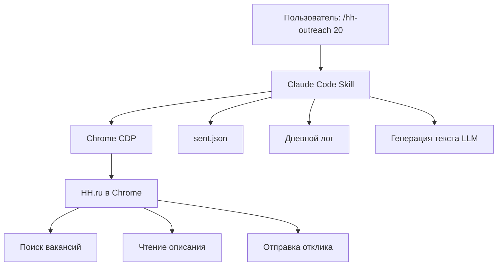
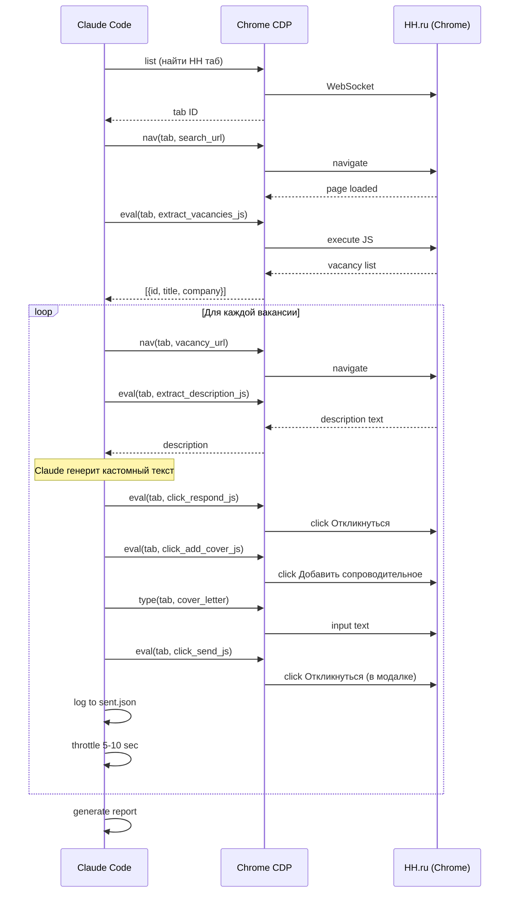
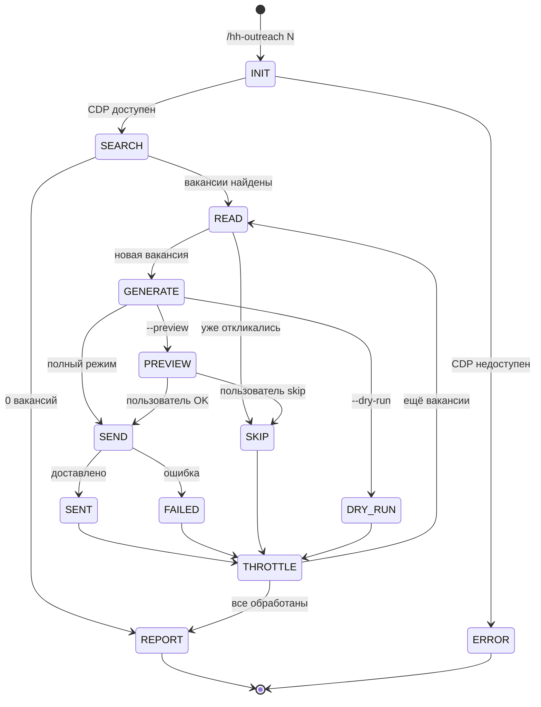

# HH Outreach - Архитектура

## Обзор

## Компоненты

### 1. Скилл (SKILL.md)
- Расположение: `~/.claude/skills/hh-outreach/SKILL.md`
- Тип: Claude Code skill (markdown-спецификация)
- Claude читает SKILL.md и выполняет инструкции
- Нет исполняемого кода - только спецификация поведения

### 2. Chrome CDP
- Расположение: `~/.claude/skills/chrome-cdp/scripts/cdp.mjs`
- Node.js 22+ (путь: `~/.nvm/versions/node/v22.22.1/bin/node`)
- WebSocket подключение к Chrome DevTools Protocol
- Требует: Chrome с включённым remote debugging

### 3. Хранилище данных
- Расположение: `~/hh-outreach-data/`
- `sent.json` - история всех откликов (source of truth)
- `log-YYYY-MM-DD.md` - дневные логи (человекочитаемые)

### 4. LLM генерация
- Claude (Opus 4.6) сам генерит текст на основе описания вакансии
- Шаблон в SPEC.md: модульная структура (opening + reaction + offer + what_i_do + slots + cta)
- Без внешних LLM вызовов

## Взаимодействие с HH.ru

## State Management

## Зависимости

| Зависимость | Версия | Назначение |
|-------------|--------|-----------|
| Node.js | 22+ | CDP скрипт |
| Chrome | любая | Браузер с remote debugging |
| cdp.mjs | текущая | CDP клиент |
| Claude Code | Opus 4.6 | LLM + оркестрация |
| gh CLI | авторизован | GitHub (опционально) |
