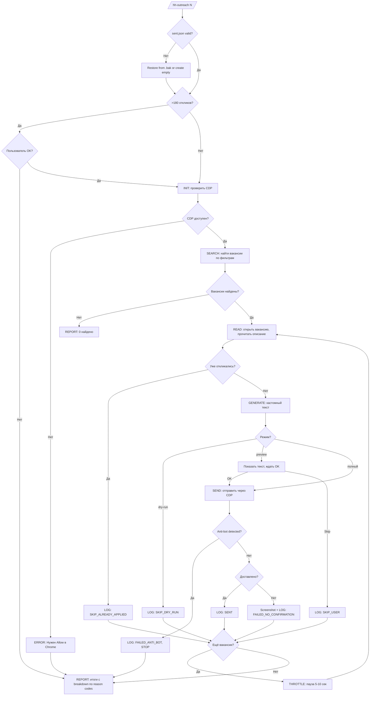

# HH Outreach - Спецификация (SDD)

## 1. Назначение

Скилл `/hh-outreach` для Claude Code. Автоматизирует отправку откликов на вакансии HH.ru с персонализированными сопроводительными письмами. Цель - лидогенерация: предлагать подряд на ИП вместо найма в штат.

## 2. Вызов

```
/hh-outreach <количество> [запрос] [--флаги]
```

Примеры:
```
/hh-outreach 20
/hh-outreach 20 "SMM маркетолог контент"
/hh-outreach 20 --query "контент-стратег" --min-salary 80000
/hh-outreach 20 --dry-run
/hh-outreach 20 --preview
```

## 3. Режимы

| Режим | Флаг | Поведение |
|-------|------|-----------|
| Полный | (без флага) | Поиск + генерация + отправка |
| Dry-run | --dry-run | Поиск + генерация, БЕЗ отправки |
| Preview | --preview | Показать каждый текст перед отправкой |

## 4. Фильтры

| Параметр | Дефолт | Флаг |
|----------|--------|------|
| Запрос | маркетолог OR SMM OR контент | --query "..." |
| Период | 1 день | --period N (дни) |
| Формат | удалённо | --any-format |
| Мин. зарплата | нет | --min-salary N |
| Исключения | WB, Ozon, продажи, HR, стажёры, дизайнеры, разработчики | --no-filter |

## 5. Flow



## 6. Шаблон сопроводительного письма

### Структура

```
{OPENING}

{VACANCY_REACTION}

{OFFER}

{WHAT_I_DO}

{SLOTS}

{CTA}
```

### Блок OPENING (5 вариантов, выбирается случайно)

1. `Коллеги из {КОМПАНИЯ}, привет!`
2. `Привет, команда {КОМПАНИЯ}!`
3. `{КОМПАНИЯ}, привет!`
4. `Привет! Пишу по вашей вакансии {ДОЛЖНОСТЬ}.`
5. `Коллеги, привет!`

### Блок VACANCY_REACTION

```
Насколько я понимаю, вы ищете {ПЕРЕСКАЗ_СВОИМИ_СЛОВАМИ -
1-2 предложения на основе описания вакансии}.
```

Правила:
- Пересказать задачи из вакансии СВОИМИ словами
- Не копировать текст вакансии буквально
- Упомянуть 2-3 ключевые задачи
- Без тире (—), только дефис с пробелами ( - )

### Блок OFFER

Если зарплата указана:
```
У меня есть предложение получше. Вместо найма в штат 
предлагаю поработать на подряде - оплата на моё ИП, 
{SALARY * 0.8} вместо {SALARY}.
```

Если зарплата НЕ указана:
```
У меня есть предложение получше. Вместо найма в штат 
предлагаю поработать на подряде - оплата на моё ИП, 
на 20% дешевле чем штатный сотрудник с налогами.
```

Нормализация зарплаты:
- "от 100 000" → 100000
- "до 150 000" → 150000
- "от 100 до 150" → 125000 (среднее)
- "$2000" → перевести по курсу ~100 → 200000
- "gross" → умножить на 0.87
- Не парсится → не упоминать цену

### Блок WHAT_I_DO

2-3 предложения привязанные к задачам из вакансии. Примеры модулей:

| Если в вакансии | Писать |
|-----------------|--------|
| SMM, соцсети, контент-план | AI-контент-завод генерит посты, визуалы, публикует на все площадки автоматически |
| Лидогенерация, B2B, трафик | Лид-машина автоматически находит клиентов, обогащает контакты, генерит предложения |
| Воронки, автоворонки, email | Вебинарные воронки с автоматическими прогревами, квалификация лидов |
| SEO, контент-маркетинг | AI генерит экспертные тексты под семантическое ядро, публикует |
| CRM, retention, рассылки | AI автоматизирует сегментацию, персональные письма, триггерные цепочки |
| Видео, reels, YouTube | AI-видеопайплайн: HeyGen, ElevenLabs, автоматическая нарезка |
| Блогеры, influencer | AI ищет блогеров, генерит ТЗ, отслеживает результаты |

### Блок SLOTS

```
Я работаю как удалённый подрядчик. Беру до 5 клиентов 
одновременно, сейчас у меня есть 2 свободных слота.
```

### Блок CTA

```
Кейсы: timzinin.com
Поговорить: calendly.com/timzinin
```

### Правила текста (anti-AI)
- Без тире (—), только дефис с пробелами ( - )
- Без AI-паттернов: "не X, а Y", hedge words, passive voice
- Без слов: "инновационный", "комплексный", "синергия", "оптимизация"
- Компактные абзацы, без лишних пустых строк
- Разговорный тон

## 7. CDP интеграция

### Инструмент
```bash
CDP=~/.claude/skills/chrome-cdp/scripts/cdp.mjs
NODE=~/.nvm/versions/node/v22.22.1/bin/node
```

### Команды

| Действие | Команда |
|----------|---------|
| Список табов | `$NODE $CDP list` |
| Навигация | `$NODE $CDP nav <tab> <url>` |
| Выполнить JS | `$NODE $CDP eval <tab> <expr>` |
| Ввод текста | `$NODE $CDP type <tab> <text>` |
| Скриншот | `$NODE $CDP shot <tab> <file>` |

### Принцип: DOM-based клики

НЕ ИСПОЛЬЗОВАТЬ `clickxy` (ломается при zoom, layout shift, popup).

Правильно:
```javascript
// Клик по textContent
eval "var btns = document.querySelectorAll('a, button'); 
for (var i = 0; i < btns.length; i++) { 
  if (btns[i].textContent.trim() === 'Откликнуться') { 
    btns[i].click(); break; 
  } 
}"
```

### Polling вместо sleep

```javascript
// Ждать textarea (polling 500ms, timeout 5s)
for (var attempt = 0; attempt < 10; attempt++) {
  await new Promise(r => setTimeout(r, 500));
  if (document.querySelector('textarea')) break;
}
```

### Обработка ошибок

| Ошибка | Reason code | Действие |
|--------|-------------|----------|
| Daemon failed | FAILED_CDP_UNAVAILABLE | Остановить, сообщить пользователю |
| Нет кнопки Откликнуться | SKIP_ALREADY_APPLIED | SKIP |
| Textarea не появилась | SKIP_NO_TEXTAREA | SKIP |
| Резюме не доставлено | FAILED_NO_CONFIRMATION | FAILED |
| Chrome завис | FAILED_CDP_TIMEOUT | Остановить, частичный отчёт |
| Dry-run режим | SKIP_DRY_RUN | Записать в лог, не отправлять |
| Пользователь пропустил в preview | SKIP_USER | SKIP |
| Captcha / anti-bot | FAILED_ANTI_BOT | STOP, показать частичный отчёт |
| CDP eval timeout | FAILED_CDP_ERROR | SKIP текущую, продолжить |

### Дополнительные ветки flow

**>180 откликов:** При sent.json.vacancies.length > 150 - показать предупреждение. При > 180 - запросить подтверждение у пользователя перед продолжением.

**Anti-bot detection:** Если после "Откликнуться" страница содержит "капча", "подтвердите", "подозрительная активность" - немедленный STOP с reason FAILED_ANTI_BOT и частичным отчётом.

**Corrupted sent.json:** При загрузке: если JSON не парсится - попробовать восстановить из sent.json.bak. Если .bak тоже corrupted - создать пустой и предупредить пользователя.

**UI fallback:** Если кнопка не найдена по textContent - сделать screenshot, показать warning, SKIP с reason FAILED_CDP_ERROR.

## 8. Хранение данных

### sent.json

```json
{
  "vacancies": [
    {
      "id": "131799467",
      "company": "Арт-Матита",
      "title": "Маркетолог автоворонок",
      "salary": "100000",
      "salary_raw": "от 100 000 ₽ за месяц, на руки",
      "status": "SENT",
      "reason": null,
      "date": "2026-04-03",
      "message_preview": "Коллеги из Арт-Матита..."
    }
  ]
}
```

Atomic write:
```bash
# Читаем текущий
cp sent.json sent.json.bak
# Обновляем через tmp
write_to sent.json.tmp
mv sent.json.tmp sent.json
```

### Дневной лог (log-YYYY-MM-DD.md)

```markdown
# HH Outreach Log - 2026-04-03

| # | ID | Компания | Вакансия | ЗП | Статус | Reason |
|---|-----|----------|----------|-----|--------|--------|
| 1 | 131799467 | Арт-Матита | Маркетолог автоворонок | 100К | SENT | - |
| 2 | 131627607 | ВМСК | Growth маркетолог | - | SKIP | NO_TEXTAREA |
```

## 9. Throttling и безопасность

- Пауза 5-10 сек (random) между откликами
- Максимум 30 откликов за одну сессию
- При >150 откликов в sent.json - предупреждение о лимите HH
- При >180 - запрос подтверждения у пользователя

## 10. Отчёт (Шаг 7)

```
HH Outreach: завершено

Отправлено: 18/20
Пропущено: 2 (1x NO_TEXTAREA, 1x ALREADY_APPLIED)

Топ вакансии:
1. MOREMIO - Продюсер контент-завода (90К)
2. IndigoSoft - Growth B2B ($2500)
3. Первый Бит - AI маркетинг

Всего за всё время: 84 откликов (из 200 лимита)
```
